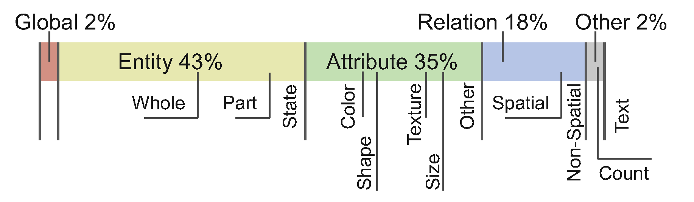

# Evaluation on the DPG-Bench

DPG-Bench provides a two-level category scheme, with 5 level-1 categories and 13 level-2 categories.

<figure>
    
    <figcaption style="text-align: center;">Fig. 1: DPG-Bench Information. The level-1 categories and the level-2 categories.</figcaption>
</figure>


Evaluation on the DPG-Bench benchmark. We report Level-1 results.

| Methods  | # Params | Global  | Entity  | Attribute | Relation | Other   | Overall $\uparrow$ |
| -------- | -------- | ------- | ------- | --------- | -------- | ------- | ------------------ |
| Infinity | 2.20B    | 80.2920 | 89.5032 | 87.4342   | 88.8889  | 90.8484 | 82.9997            |
| +ScaleKV | 2.20B    | 81.6327 | 89.3115 | 86.6169   | 89.9935  | 89.6552 | 82.9548            |
| FastVAR  | 2.20B    | 81.1005 | 87.9949 | 88.4919   | 91.2041  | 81.2000 | 82.6458            |


# How to eval

- https://github.com/TencentQQGYLab/ELLA?tab=readme-ov-file#-dpg-bench
- https://www.modelscope.cn/models/iic/mplug_visual-question-answering_coco_large_en

由于DPG指标测试需要用到VQA模型mPLUG（基于魔塔社区），根据上述参考repo和文档，建议新建虚拟环境

```python
conda create -n modelscope python=3.11
# -i https://pypi.tuna.tsinghua.edu.cn/simple
pip install torch==2.3.1 torchvision==0.18.1 torchaudio==2.3.1 --index-url https://download.pytorch.org/whl/cu121
pip install modelscope
pip install -r evaluation/dpg_bench/dpg_requirements.txt
pip install "pip<24.1"  # maybe roll back first
```

配置好环境后，直接执行脚本

```bash
bash bash scripts/dpg_infer4eval.sh
```


